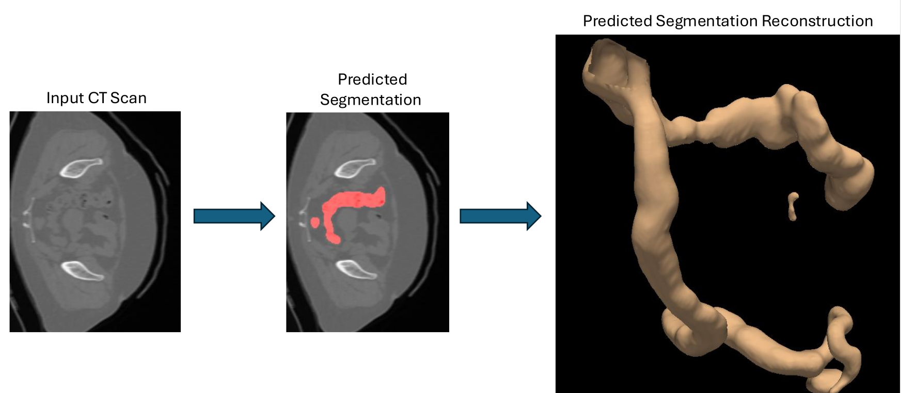

# Research on Medical Image Segmentation Libraries

This repository focuses on studying state-of-the-art medical image segmentation libraries, with a goal of integrating them into a Python pipeline for automated segmentation and 3D reconstruction from CT and MRI scans.

## Libraries Reviewed

### 1. TotalSegmentator

**TotalSegmentator** is an open-source deep learning tool specifically designed for automatic and robust segmentation of anatomical structures in medical imaging, such as CT and MRI scans. Developed by the Research and Analysis department at University Hospital Basel, it leverages the powerful nnU-Net framework to identify and delineate over 100 anatomical structures, including organs, bones, muscles, and vessels.

- **Original repository**: [TotalSegmentator GitHub](https://github.com/wasserth/TotalSegmentator)

In this study, I used TotalSegmentator in a Python pipeline to extract segmentation masks for various organs from CT scan data. The predicted masks were compared to ground truth masks from the TotalSegmentator dataset, and both sets of masks were reconstructed into 3D models using the VTK library and the Marching Cubes algorithm. Below, you can find examples of a segmentation prediction for a slice and its corresponding 3D reconstruction of the colon.

## Datasets

### Totalsegmentator CT Scan Dataset

The dataset consists of 1228 CT images with segmented 117 anatomical structures covering a majority of relevant classes for most use cases. The CT images were randomly sampled from clinical routine, thus representing a real world dataset which generalizes to clinical application. The dataset contains a wide range of different pathologies, scanners, sequences and institutions.

Link to the dataset: [Totalsegmentator_dataset_v201.zip](https://zenodo.org/records/10047292)
